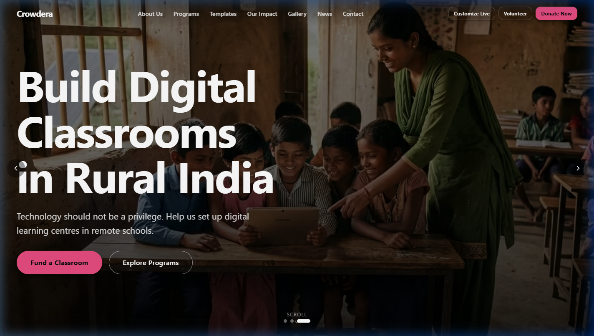
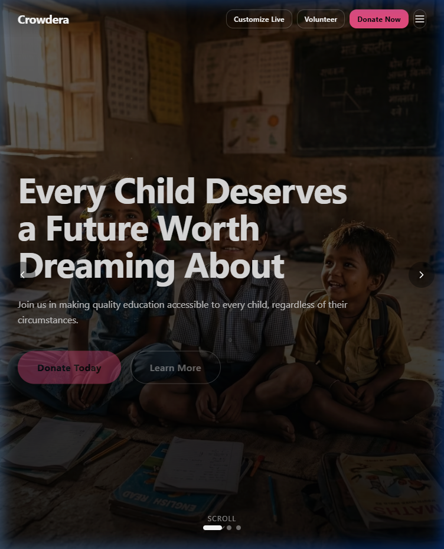
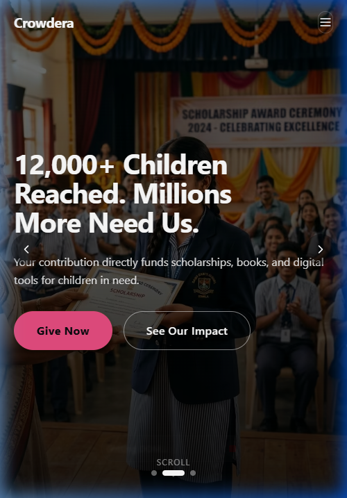
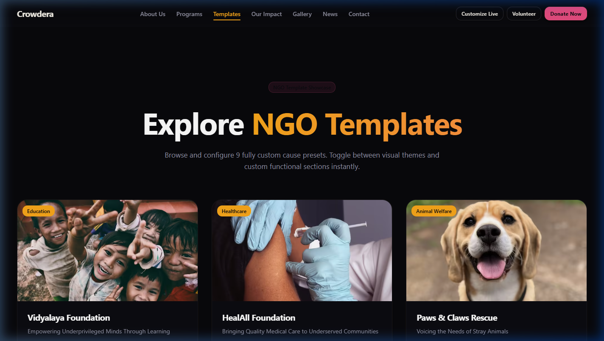
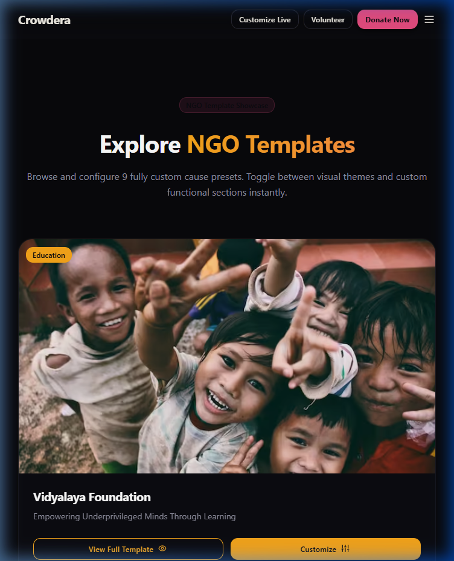
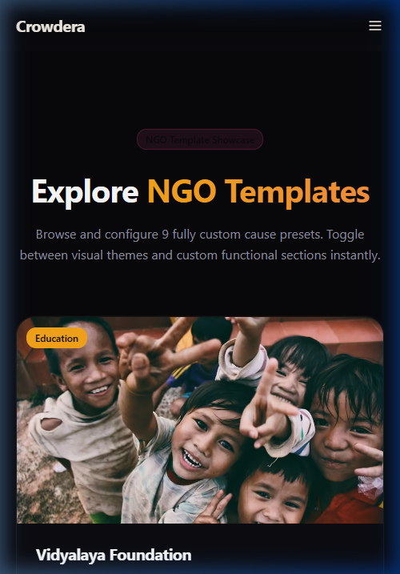

# NGO Website Template System Submission

**One reusable template engine that generates 9 production-ready NGO websites — structure × theme × copy × layout — with a live no-code builder, purpose-built for Crowdera's Website Builder Platform.**

---

### 🚀 Quick Links
* **Live Deployed Site**: [https://crowdera-ngo-templates.netlify.app](https://crowdera-ngo-templates.netlify.app)
* **Template Gallery**: [/templates](https://crowdera-ngo-templates.netlify.app/templates) (Browse all 9 causes and their standalone sites)
* **Sample Standalone Site**: [/sites/education](https://crowdera-ngo-templates.netlify.app/sites/education) (The clean production Vidyalaya Foundation site)
* **Live Customizer (No-Code Builder)**: [/templates/demo](https://crowdera-ngo-templates.netlify.app/templates/demo) (Interactive brand & layout personalizer)
* **Information Architecture**: [INFORMATION_ARCHITECTURE.md](./docs/INFORMATION_ARCHITECTURE.md) (Architecture of layout engine and data models)
* **Target User Personas**: [USER_PERSONA.md](./docs/USER_PERSONA.md) (Profiles and needs of NGOs, Donors, and Volunteers)
* **Style Guide**: [/style-guide](https://crowdera-ngo-templates.netlify.app/style-guide) (Inspect the design system and theme tokens)
* **GitHub Repository**: [https://github.com/bsrikumar855-dot/NGO_Template_Crowdera-](https://github.com/bsrikumar855-dot/NGO_Template_Crowdera-)

---

### 🏆 Why This Wins
Instead of 10 static design mockups, this project delivers a **config-driven template engine**. Each of the 9 NGO cause presets (education, healthcare, animal welfare, environment, humanitarian, faith-based, community development, arts & culture, and disaster relief) generates a fully complete, standalone production website with no builder chrome or leakage. The exact same polymorphic component engine powers the live builder, allowing organizations to personalize typography, shapes, colors, and section structures, and export a clean site in minutes. This maps directly to Crowdera's actual business model as a website builder platform, delivering reusable software architecture rather than single-use code templates.

---

### 📊 Requirements Coverage

| Feature / Brief Item | Implementation Status & Details | Link to Source / Route |
| :--- | :--- | :--- |
| **10 Template Sections** | All 10 sections implemented: Hero (Autoplay Carousel/Video), Nav, About (Polymorphic), Impact Stats (Animated Counters), Programs (Cards/Scroll), Testimonials (Rating Stars), Gallery (Video/Lightbox), News, CTA Band, and Footer. | [Components Directory](./components/sections) |
| **Video Gallery & Lightbox** | Supports mixed image & video types. Features a custom lightbox modal with click-outside-to-close, keyboard Escape navigation, and focus trap. | [GallerySection.tsx](./components/sections/GallerySection.tsx) |
| **5-Star Rating Row** | Testimonials dynamically render a 5-star row when `rating` exists, hiding gracefully when absent. Includes accessible ARIA labeling. | [TestimonialsSection.tsx](./components/sections/TestimonialsSection.tsx) |
| **Responsive Homepage** | Dynamic routing renders a complete production homepage for any selected cause slug under `/sites/[cause]`. | [sites/[cause]/page.tsx](./app/sites/%5Bcause%5D/page.tsx) |
| **Template Gallery Page** | Grid gallery of all 9 NGO cause cards. "View Full Template" links to standalone sites, and "Customize" links to the builder. | [templates/page.tsx](./app/templates/page.tsx) |
| **Style Guide** | Interactive token inspector for typography, spacing, elevations, radius variants, and HSL color variables. | [style-guide/page.tsx](./app/style-guide/page.tsx) |
| **Design Rationale** | Full architectural summary, design decisions, folder structure, and accessibility review. | [DESIGN_RATIONALE.md](./docs/DESIGN_RATIONALE.md) |
| **Accessibility Audit** | Audit checklist covering WCAG 2.1 AA hierarchy, landmarks, ARIA labels, focus states, and tab-trap details. | [A11Y_AUDIT.md](./docs/A11Y_AUDIT.md) |
| **Dark Mode & Styling** | Active theme variables compile dynamically on `.site-scope` scope, enabling instant dark/light presets and builder personalization. | [THEMING.md](./docs/THEMING.md) |
| **Information Architecture** | Details project layout engine, config schemas, route structures, and data flows. | [INFORMATION_ARCHITECTURE.md](./docs/INFORMATION_ARCHITECTURE.md) |
| **User Personas Profiles** | Defines demographics, paint points, and features mappings for NGO Admins, Donors, and Volunteers. | [USER_PERSONA.md](./docs/USER_PERSONA.md) |

---

### 📸 Responsive Screenshots

#### Standalone Cause Homepage (Vidyalaya Foundation)
* **Desktop (1440px)**
  
  *Polymorphic hero carousel, transparent glass header, and modular grid structure.*

* **Tablet (768px)**
  
  *Metric counters wrap cleanly, typography sizes scale, and container widths adjust.*

* **Mobile (375px)**
  
  *Mobile drawer menu integration and stacked single-column layouts for touch target ergonomics.*

#### Template Gallery (All NGO Causes)
* **Desktop (1440px)**
  
  *Grid card list showing the 9 pre-configured cause templates.*

* **Tablet (768px)**
  
  *2-column responsive grid showing tag badges and clear customizer links.*

* **Mobile (375px)**
  
  *Single-column layout with visual badges and stacked buttons.*

---

### 🛠️ Technology Stack
* **Framework**: Next.js 14 (App Router)
* **Language**: TypeScript (Strict Types)
* **Styling**: TailwindCSS & HSL CSS Variables
* **Animation**: Framer Motion (Optimized micro-interactions and scroll animation triggers)
* **Icons**: Lucide React
* **Components**: Radix UI primitives & Class Variance Authority (CVA)

*Note: This exactly matches Crowdera's modern React/Next/Tailwind architecture, facilitating direct drop-in integration into your production repositories.*
